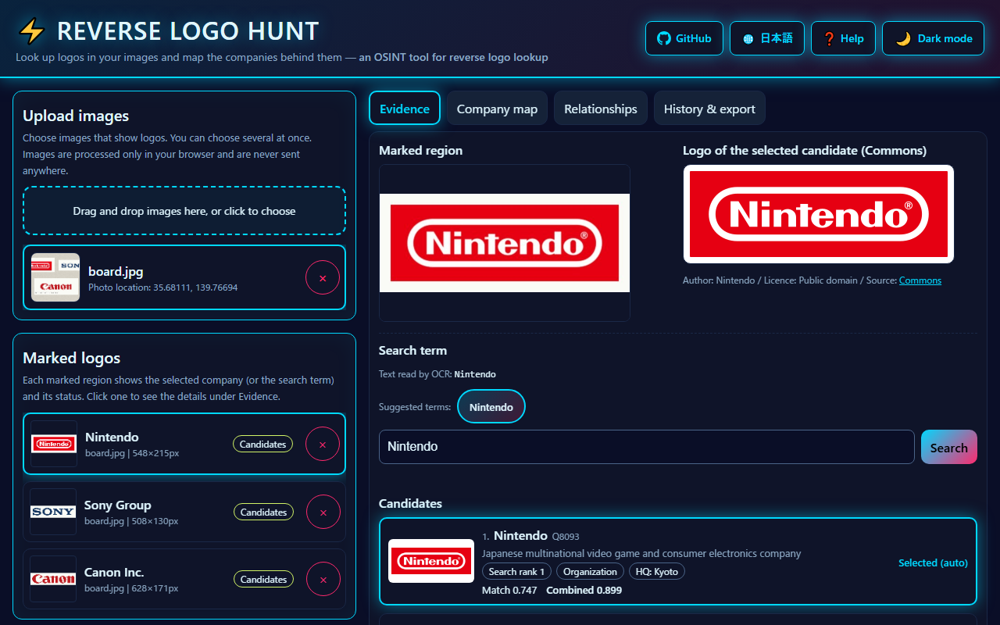
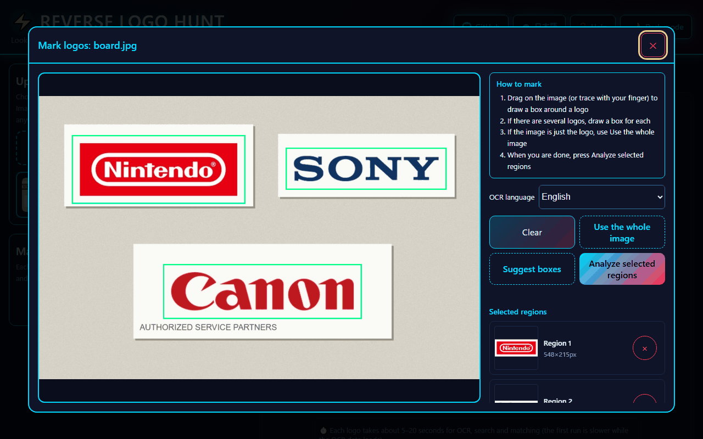
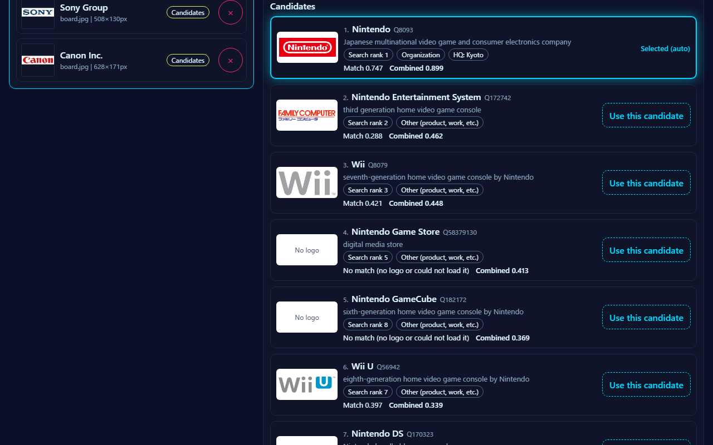
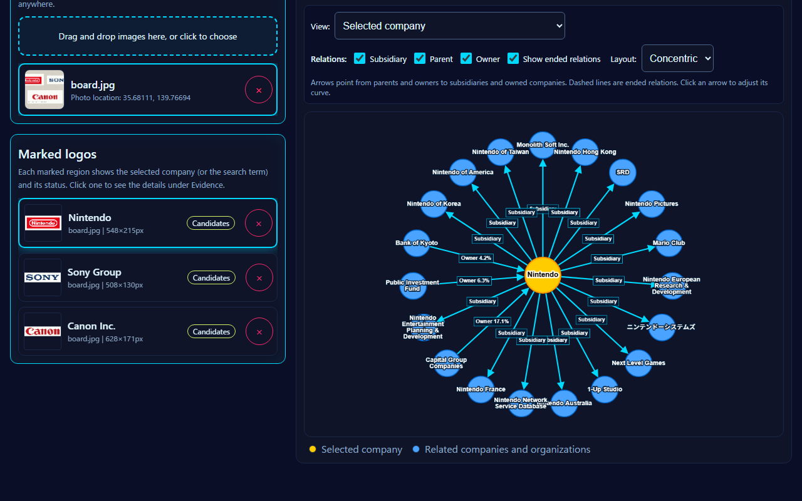
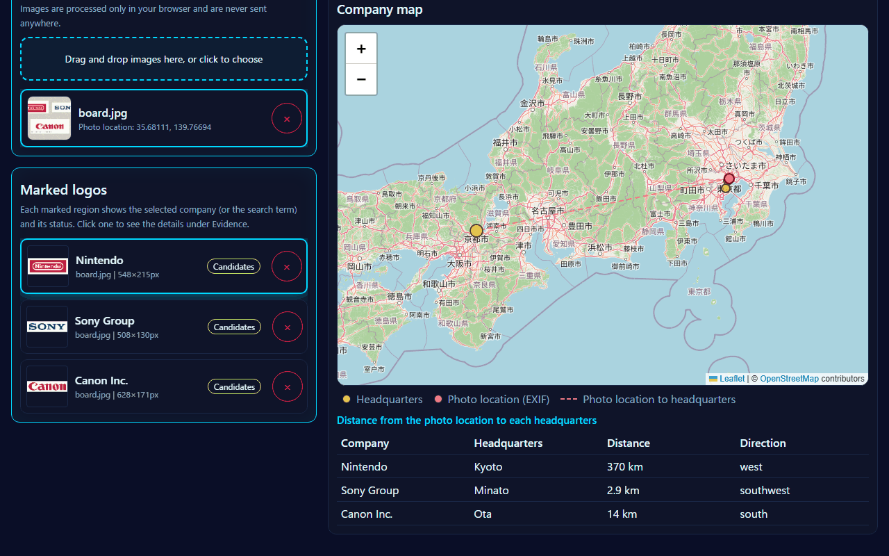
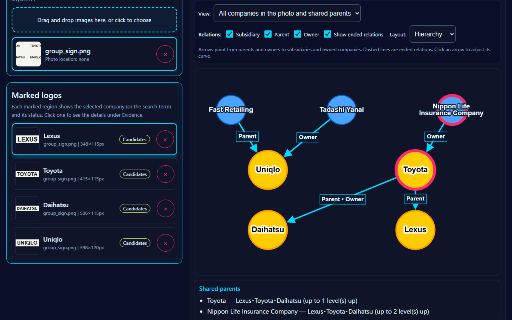
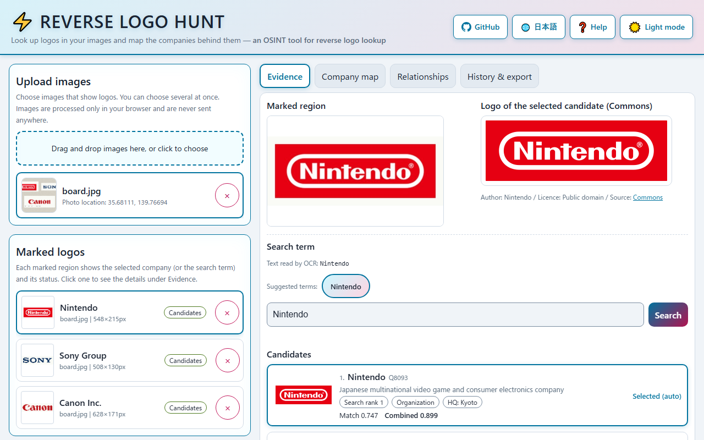

English · [日本語](README.md)

# Reverse Logo Hunt - An OSINT Tool That Looks Up Logos and Maps the Companies Behind Them


[](https://ipusiron.github.io/reverse-logo-hunt/)

**Day091 - 100 Security Tools with Generative AI**

Reverse Logo Hunt is an OSINT tool that starts from company logos caught in photos and images, looks the companies up on Wikidata, and puts their headquarters and their parents, subsidiaries and owners on a map and a relationship graph.

When you draw a box around a logo, the tool reads its text with OCR, searches Wikidata, and lines up the candidates after comparing each one with its official logo on Wikimedia Commons. It does not decide on looks alone: it adds up the search rank, the type (whether the item is an organization) and the logo match to propose a first choice, and you make the final call.

Images are processed only in your browser and never sent anywhere. No trademark logo data is bundled; the logos to compare are fetched from Commons each time.

---

## 🌐 Demo

👉 **[https://ipusiron.github.io/reverse-logo-hunt/](https://ipusiron.github.io/reverse-logo-hunt/)**

You can try it directly in your browser.

---

## 📸 Screenshots

>
>
>*Result after marking and analyzing three logos (Nintendo selected)*

>
>
>*Drawing boxes around logos (mouse, touch or pen)*

>
>
>*Candidates found for "SONY" (search rank, type, match, combined score)*

>
>
>*Relationship graph (arrows point from parents and owners to subsidiaries and owned companies)*

>
>
>*Headquarters and the photo location (EXIF, near Tokyo Station), with distances and directions*

>
>
>*All companies in the photo and their shared parents (text-only signs LEXUS, TOYOTA, DAIHATSU and UNIQLO; Toyota Motor and Nippon Life Insurance are shared parents)*

>
>
>*Light mode*

The signs in the screenshots are public-domain logos from Wikimedia Commons placed on an image made for the screenshots.

---

## ✨ Features

- Mark logos: drag with a mouse, finger or pen to draw boxes. "Use the whole image" and "Suggest boxes" (which boxes groups of letters or logo parts word by word) are also available
- Read text: OCR with Tesseract.js (WASM). If nothing can be read, the tool crops to the logo plate, removes the frame around the letters and reads again
- Choose or edit the search term: up to 5 search-term suggestions are made from the OCR result (short abbreviations such as BMW, HP and 3M, and Japanese words, are kept). For logos without text or misread text, type a term in the field and search again
- Rank candidates: for the top 8 results of the Wikidata search (wbsearchentities), the tool fetches the logo, headquarters and type, and compares the candidates that have a logo (up to 6) with their official logo on Commons
- You make the final call: the combined score of search rank, type and match proposes a first choice. If the first and second differ by less than 0.05, you are asked to check. You can switch to any candidate
- Map: shows the selected company's headquarters and the photo location (EXIF GPS) on one map
- Relationship graph: draws parents (P749), subsidiaries (P355) and owners (P127) with arrows from parents and owners to children. Start and end years and ownership shares are added, and ended relations are dashed. You can filter by kind, change the layout and adjust each arrow's curve
- Shared parents: when companies are selected for two or more logos in the photo, the tool follows parents and owners up to three levels and lists and draws the parents they share
- Distance and direction: a table of the distance and 8-point direction from the photo location (EXIF) to each headquarters selected in the same image, with dashed lines on the map
- OCR language: English, or Japanese and English (loads about 2.0 MB of extra Japanese data)
- Export: save the images, marked regions, candidates and selected companies as JSON and load them again. You can also export a PNG with the boxes and company names drawn
- Interface: Japanese and English, dark and light themes, phone widths, keyboard operation

### 📐 Screen layout

| Area | Content |
|:--|:--|
| Upload images (left) | Loading images and the list of loaded images (with or without a photo location) |
| Marked logos (left) | For each marked region, the selected company and its status (candidates, no candidates, no search term, error) |
| Evidence tab | The marked region and the logo of the selected candidate (author, licence, source), the search term, the candidate list and the score breakdown |
| Company map tab | Headquarters of the companies selected in the same image, the photo location, and a table of distances and directions from the photo location |
| Relationships tab | View switch (selected company / all companies in the photo and shared parents), filters by kind, ended relations, layouts (concentric, force, hierarchy, circle) and arrow curves |
| Buttons at the top right | GitHub, Japanese/English switch, Help, dark/light switch |
| History & export tab | Analysis history (image names and counts), JSON export and import, PNG export with boxes |

Click an arrow in the relationship graph to change its curve style (bezier, free bezier, straight, segments), its strength and the position of its control point. "Apply to all arrows" makes all arrows the same.

### 🔄 Compared with manual research

| Task | By hand | This tool |
|:--|:--|:--|
| Several logos | Look up each one with image search or an encyclopedia | Mark them in one image and analyze them together |
| Identifying the company | Easy to confuse companies and products with similar names | Lines up candidates and lets you choose by search rank, type and match breakdown |
| Comparing with the official logo | By eye | Shape, light-dark structure, aspect ratio and colour as numbers (a guide) |
| Headquarters and relations | Look up each company separately | Pulls headquarters, parents, subsidiaries and owners from Wikidata into a map and a graph |
| Sources | Write them down by hand | Shows the Commons author, licence and source page and keeps them in the JSON |
| Handling of images | Often sent to an image search service | Images are never sent anywhere |

---

## 📖 How to use

1. Drag and drop images, or click to choose them (several at once is fine)
2. On the screen that opens, draw a box around each logo. Repeat for several logos
3. Press "Analyze selected regions". The tool reads the text, searches Wikidata and compares each candidate with its logo on Commons
4. Compare the candidates on the Evidence tab. If the proposed first choice is wrong, press "Use this candidate" on the right one
5. See the headquarters and photo location on "Company map", and parents, subsidiaries and owners on "Relationships"
6. On "History & export", export JSON (which you can import again) or export a PNG with the boxes drawn

If it does not work, try the following.

- Logos without text (symbol-only logos) or misread text: type the company or brand name in "Search term" and press "Search"
- Japanese signs: on the marking screen, set "OCR language" to "Japanese and English" before analyzing
- The company you want is not among the candidates: search again with the official name, the English name or an abbreviation
- The first choice is a subsidiary or a product: choose the parent in the list (type "Organization", higher search rank)

### Tips for better accuracy

- Images with a simple background and a clearly printed logo work best, such as envelopes, invoices, brochures, business cards and product packages from a company
- Leave a little margin around the logo when you draw the box (matching treats the colour along the edge of the box as the background)
- Put only one logo in each box. When a company name and a slogan sit side by side, boxing only the name narrows the search term
- Large images are scaled down so the long side is 1536 px. For a small logo in a large photo, crop the original image first

### Example: the Nintendo logo

This is what happened when the Nintendo logo (white letters on a red plate) on the screenshot signs was marked (measured on 2026-10-09).

1. The first OCR pass could not read it; the retry, which crops to the plate and removes the frame, read "Nintendo"
2. Searching Wikidata for "Nintendo" gave Nintendo (Q8093) as search rank 1, type organization, headquarters in Kyoto
3. The logo match with the Commons logo (Nintendo.svg, public domain) was 0.747 and the combined score 0.899, so it became the proposed first choice
4. The relationship graph showed 16 subsidiaries and 3 owners (Capital International, The Bank of Kyoto and the Public Investment Fund). Wikidata lists no parent

Wikidata is updated every day, so counts and ranks may change.

### ⌨️ Keyboard

| Key | Action |
|:--|:--|
| `1`–`4` | Switch tabs (ignored while typing in a field) |
| `←` / `→` | On a tab, move to the next or previous tab |
| `Esc` | Close Help or the marking screen |

---

## 🔬 How it works

### The analysis flow

1. Pass the marked region to OCR (small regions are scaled up to 120 px high, and white-on-dark signs are inverted). If nothing can be read, crop to the plate, remove the frame around the letters and read again
2. Make search-term suggestions from the text (when letter heights and confidences are available, larger and surer words come first)
3. Search Wikidata with `wbsearchentities`, keeping the search rank as it is
4. For the top 8 results, fetch the logo (P154), the coordinates (P625) of the headquarters location (P159) and the type with SPARQL. Only validated QIDs go into SPARQL; your text never does
5. For candidates with a logo (up to 6), fetch a 330 px wide thumbnail from Commons and compare it with the marked region
6. Sort by combined score and propose the first one

### Logo matching (shape, light-dark structure, aspect ratio, colour)

For the marked region, the colour along the edge is taken as the background, and the parts that differ from it are taken as the foreground (the logo). Many Commons logos have a transparent background, so their foreground is decided by transparency (a logo painted all the way to the edges is taken as a whole). The four values below are then compared separately.

| Value | What is compared | Weight |
|:--|:--|:--:|
| Shape | Overlap of the "foreground share" after fitting the foreground's bounding box into a 32×32 grid | 0.35 |
| Light-dark structure | Absolute correlation of the brightness pattern (24×24) inside the bounding box; also works for white-on-dark signs | 0.25 |
| Aspect ratio | Closeness of the bounding boxes' aspect ratios | 0.15 |
| Colour | Closeness of the distribution over 12 hue bins and 1 achromatic bin, foreground pixels only (white and black are not told apart) | 0.25 |

The logo match total is the weighted sum (0 to 1).

### Ranking candidates (combined score)

The company is never decided by the logo's looks alone. A subsidiary's logo sometimes contains the parent's logo, so the subsidiary can look closer.

Combined = 0.4 × search rank score + 0.2 × type score + 0.4 × logo match total

- Search rank score: rank 1 is 1, rank 2 is 0.667, rank 3 is 0.5, rank 4 is 0.4 (1 ÷ (1 + 0.5 × (rank − 1)))
- Type score: 1 for an organization (an item with a headquarters location, industry, parent, subsidiary or owner) or a brand, otherwise (product, work, etc.) 0.4
- Logo match total: a candidate without a logo, or whose logo cannot be loaded, counts as 0.5 (no evidence either way)

### When relations started and ended, and ownership shares

Relations are fetched from Wikidata statements with their qualifiers. Start (P580) and end (P582) years and the ownership share (P1107), when present, are added to the arrow's label (for example "Owner 17.1%" or "Subsidiary (1990–2016)"). A relation with an end year is drawn as an ended relation with a dashed line and can be hidden with "Show ended relations". Deprecated statements are not used.

### Shared parents

When companies are selected for two or more logos in the photo, the tool follows parents (P749) and owners (P127) one level at a time, up to three levels (one SPARQL query per level). When two or more companies reach the same ancestor, it is shown as a shared parent. When selected companies are parent and child, the parent company itself counts as a shared parent. Only relations without an end year are followed.

### Distance from the photo location to the headquarters

The great-circle distance on a sphere with a radius of 6371.0088 km (the haversine formula) and the bearing from the photo location (8 points). It differs from the ellipsoid by at most about 0.5%, so use it as a guide. Distances under 10 km have one decimal place; others are whole numbers.

### How well the matching works

For 16 companies with public-domain logos on Commons, three photo-like images were made for each (printed on paper; tilted 4° on a grey background; a white-on-dark sign), and we measured how often the real logo came first among 21 companies' logos (2026-10-09, an evaluation outside this repository; the logo images are not included).

| Set | This tool | Method before the rewrite |
|:--|:--:|:--:|
| 8 companies used to set the weights (Nintendo, Sony Group, Toyota, Canon, Panasonic, Google, Apple, BMW) | 22/24 | 6/24 |
| 8 companies not used to set the weights (Honda, Samsung, Intel, Microsoft, Starbucks, IBM, Adidas, Shell) | 24/24 | 5/24 |

The two misses were the paper and tilted Nintendo images, which narrowly lost to the Nintendo Software Technology logo (which contains the Nintendo logo) and to Shell's red lettering. In the tool itself the search term narrows the candidates and the search rank is added, so Nintendo comes first (see the second item under "Ways of using this tool in particular").

These values come from images made by slightly altering the logos themselves. Real photos, with perspective distortion, reflections, dirt and partly hidden logos, give lower values.

### Network access

| Destination | What is sent | Used for |
|:--|:--|:--|
| www.wikidata.org | The search term | Searching for candidates |
| query.wikidata.org | Candidate QIDs | Logos, headquarters, types and relations (SPARQL) |
| commons.wikimedia.org | Logo file names | Thumbnail URLs, authors and licences |
| thumb.wikimedia.org / upload.wikimedia.org | Nothing (image download) | Logo thumbnails |
| tile.openstreetmap.org | Map position (tile numbers) | Map tiles |
| unpkg.com / cdn.jsdelivr.net | Nothing (download only) | Version-pinned libraries and OCR language data (English about 3.0 MB, plus about 2.0 MB when Japanese is chosen) |

The images themselves, the marked regions, the full OCR text and the photo location are never sent. Wikidata and Commons responses are kept in the browser's IndexedDB for 24 hours to speed up repeated searches.

---

## 🎯 Use cases

### Ways of using this tool in particular

- Practise spotting fake logos and knock-off products: the match breakdown shows shape, light-dark structure, aspect ratio and colour separately. For a figure with the same shape but a different colour, shape, light-dark structure and aspect ratio stay at 1.000 while only colour drops to 0.000, and the logo match total becomes 0.750 (the real one is 1.000). Being able to say in numbers where it differs from the real logo makes it teaching material for fake brands in phishing and for imitation goods
- Learn that "looks closest" is not always right: for the Nintendo logo printed on paper, the logo match alone put the subsidiary Nintendo Software Technology (0.790) above Nintendo (0.753) (measured on 2026-10-09). Adding the search rank and type gives Nintendo 0.901 and the subsidiary 0.649. You experience why "it looks similar" should be combined with other clues before it is used as evidence in OSINT
- Treat a white-on-dark sign as the same logo as the original: the light-dark structure uses the absolute correlation and colour does not tell white from black, so a black ring drawn in white on a dark background gets a logo match total of 1.000 against the original black ring. Night signs, neon and reversed prints can be compared with the original logo
- Use the candidate list to observe "name collisions": searching for "SONY" also lists Sony Music, Sony BMG and PlayStation 3 besides Sony Group (2026-10-09). Seeing how far a name spreads over organizations and products is groundwork for watching look-alike domains and brands
- Find "actually the same group" in a photo full of signs: with the four text signs LEXUS, TOYOTA, DAIHATSU and UNIQLO, Toyota Motor (shared by 3 companies, Lexus, Toyota Motor and Daihatsu, up to 1 level up) and Nippon Life Insurance (the same 3 companies, up to 2 levels up) came out as shared parents (2026-10-09). Put UNIQLO and GU side by side and Fast Retailing becomes the shared parent of the two (1 level up). You can count how many business groups the signs in a shopping street, an airport or a mall belong to
- Use the distance from the photo location to the headquarters to see "is it a local company?": for the signs photographed near Tokyo Station (photo location 35.68111, 139.76694), Nintendo's headquarters (Kyoto) was 370 km west. Lining up how near or far the headquarters of the companies in travel photos are shows the local industry and how many nationwide chains there are

### Investigation and security

- Pick up logos on signs, vehicles and uniforms in field photos and social media images, and summarize the companies involved and where their headquarters are
- Compare logos in news photos and posted images with the official logos as a clue to old designs or alterations (do not conclude alteration from the match values alone)
- In supply-chain incident investigations, look up companies from logos on parts and packaging and follow their parents and owners
- From public photos of your own company and business partners, list which partners' logos can be seen from outside and check how much public information is exposed
- Use it as teaching material for comparing logos in screenshots of phishing sites and ads with the official logos
- In OSINT-style CTF photo challenges, look up the company and headquarters from a logo in the background as a clue to narrow down the location. It also helps when writing your own challenges
- In physical security checks, look up the company from logos on work clothes and vehicles in security camera images and check them against access permissions
- From public photos around a facility (map-service photos and social media), list which contractors' signs and vehicles can be seen
- At a debriefing after an assessment, show "this is how much public photos reveal" with this tool as a prompt to review how photos are published

### Who it is for

- OSINT analysts and threat intelligence staff: people who want to map company relations from public information
- Digital forensics investigators: people who want to organize traces of companies in evidence images
- Incident response and supply-chain staff: people who want to follow the companies and parents involved in an incident
- Investigative journalists and fact-checkers: people who want to back up a company from signs and products in photos
- Security instructors, CTF authors and students: people who want teaching material and challenges for OSINT exercises
- People interested in open data: people who want to see how Wikidata and Commons are used in practice

### Education and research

- In information security and media literacy classes, demonstrate "how much an image reveals" (images are never sent anywhere)
- Use it to learn how to use open data (Wikidata and Commons), SPARQL, and how to show sources and licences
- In business or economics seminars, follow parents and owners from the logos of everyday products and draw business groups and shareholding structures
- As an introduction to image processing, observe background estimation, foreground extraction and comparisons of shape and colour, with a numeric breakdown

### Everyday life and hobbies

- See on a map where the headquarters of companies on signs in travel photos are
- Find out which parent companies the brands of appliances and food at home belong to
- Enjoy how designs changed by comparing logos in old ads and flyers with today's official logos
- When making puzzle-hunt or escape-room puzzles, build tricks that lead from photos of logos to companies and places

### Combinations

- To verify a photo location, combine it with tools that handle photo EXIF and the sun's position (such as WhereShot, another tool in this series)
- Bring the exported JSON into reports and other analysis tools by hand (see "How it works" and `js/session-core.js` for the format)

This tool is meant to help research with public information. Using it to harm others is not encouraged.

---

## ⚠️ Limitations and cautions

- People decide the company. The first place by combined score is only a proposal; compare the logos and descriptions to check
- Match values are a guide to how similar things look. They cannot prove alteration, forgery or compositing
- Companies without a logo (P154) on Wikidata cannot be matched (they still appear as candidates). Companies without headquarters coordinates do not appear on the map
- The relationship graph only shows relations recorded on Wikidata. Relations without an end year are treated as still current
- Shared parents are followed only up to three levels. Owners include individuals and investment funds
- Japanese OCR is used only when chosen in "OCR language". Vertical text is not supported
- Candidate names and descriptions are fetched in the interface language at the time of the search. After switching languages, search again to see them in the new language
- The distance is the straight-line distance between the photo location (EXIF) and the headquarters coordinates. Branches and factories are not considered
- Logos without text (symbols only) need a search term typed by hand
- Perspective distortion, reflections, dirt and partly hidden logos in photos lower the match values
- Trademarks and logos belong to their owners. When reusing images from Commons, follow the author and licence shown
- Do not collect the fetched data automatically in bulk or redistribute it

---

## 🔒 Security and privacy

- Images, marked regions, full OCR text and photo locations are never sent anywhere
- The Content Security Policy starts from `default-src 'self'` and limits network access to the destinations in the table above. `'unsafe-inline'` and `'unsafe-eval'` are not used (only `'wasm-unsafe-eval'` is allowed, for OCR's WASM)
- External libraries are version-pinned, and the `<script>` tags carry Subresource Integrity (SRI)
- Commons returns author names as HTML, so only the text is extracted and shown. All text from outside is inserted with `textContent` and is never interpreted as HTML
- Imported JSON is rebuilt from known fields only, after checking types and ranges (images must be `data:image` Base64, and URLs must be Commons URLs)
- localStorage keeps only the theme, the language, the OCR language and the history (image names and counts). The tool keeps working where storage is unavailable

---

## ❓ FAQ

Q. Are my images uploaded anywhere?
A. No. OCR and logo matching run in your browser. Only the search term, candidate QIDs and logo file names are sent.

Q. How is this different from image searches such as Google Lens?
A. Images are not sent to a server, each candidate comes with its evidence (search rank, type, match breakdown) for you to decide, and the confirmed company's headquarters and relations are drawn from open data as a map and a graph. In exchange, logos whose text cannot be read need a search term typed by hand.

Q. The graph shows old subsidiaries.
A. Relations without an end year on Wikidata are treated as still current. Relations with an end year are dashed and can be hidden by unchecking "Show ended relations".

Q. Can I use it in English?
A. Switch between Japanese and English with the button at the top right. Adding `?lang=en` to the URL also opens it in English.

---

## 📁 Directory structure

```
reverse-logo-hunt/
├── .github/                        # GitHub settings
│   └── workflows/                  # GitHub Actions
│       └── test.yml                # Runs npm test on every push and pull request
├── assets/                         # README screenshots
│   ├── screenshot.png              # Result of analyzing three logos
│   ├── screenshot-candidates.png   # Candidate list
│   ├── screenshot-graph.png        # Relationship graph
│   ├── en/                         # Screenshots of the English interface (the same 7)
│   │   ├── screenshot.png          # Result of analyzing three logos
│   │   ├── screenshot-candidates.png # Candidate list
│   │   ├── screenshot-graph.png    # Relationship graph
│   │   ├── screenshot-group.png    # All companies in the photo and shared parents
│   │   ├── screenshot-light.png    # Light mode
│   │   ├── screenshot-map.png      # Map of headquarters and photo location
│   │   └── screenshot-marking.png  # Marking screen
│   ├── screenshot-group.png        # All companies in the photo and shared parents
│   ├── screenshot-light.png        # Light mode
│   ├── screenshot-map.png          # Map of headquarters and photo location
│   └── screenshot-marking.png      # Marking screen
├── js/                             # Interface and calculation modules (ES modules)
│   ├── analysis.js                 # Search, details, logo matching and ranking (network and image loading)
│   ├── brand-text.js               # Search-term suggestions from OCR text (calculation)
│   ├── cache.js                    # 24-hour IndexedDB cache
│   ├── candidate-rank.js           # Combined score from search rank, type and match (calculation)
│   ├── commons-core.js             # Building and parsing Commons queries (calculation)
│   ├── commons.js                  # Commons queries (network and cache)
│   ├── exif-core.js                # Latitude and longitude from EXIF GPS (calculation)
│   ├── exif.js                     # Reads the photo location with ExifReader
│   ├── geo.js                      # Distance and direction between two points (calculation)
│   ├── graph.js                    # Relationship graph (Cytoscape.js)
│   ├── group-core.js               # Finds shared parents (calculation)
│   ├── i18n.js                     # Switching the interface language (Japanese and English)
│   ├── logo-match.js               # Logo matching: shape, light-dark structure, aspect ratio, colour (calculation)
│   ├── main.js                     # Builds and runs the interface
│   ├── map.js                      # Map (Leaflet and OpenStreetMap)
│   ├── marking.js                  # Marking screen (Pointer Events)
│   ├── messages.js                 # Interface text dictionary
│   ├── ocr-prep.js                 # Scaling, inversion and frame removal before OCR (calculation)
│   ├── ocr.js                      # Reads text with Tesseract.js
│   ├── roi-suggest.js              # "Suggest boxes" (calculation)
│   ├── session-core.js             # JSON export and import validation (calculation)
│   ├── storage.js                  # localStorage access that keeps working when storage is blocked
│   ├── wikidata-core.js            # Building and parsing Wikidata queries (calculation)
│   └── wikidata.js                 # Wikidata queries (network and cache)
├── test/                           # Tests for node --test
│   ├── fixtures/                   # Real API responses (2026-10-09; Wikidata is CC0)
│   │   ├── ancestors-group.json    # Parents and owners of UNIQLO, GU, Lexus, Daihatsu and Toyota
│   │   ├── details-nintendo.json   # Details of the top 8 results for "nintendo" (SPARQL)
│   │   ├── imageinfo-nintendo-sony.json # Commons imageinfo (Nintendo, Sony Group)
│   │   ├── relations-Q8093.json    # Relations of Nintendo (SPARQL)
│   │   └── search-nintendo.json    # Search results for "nintendo" (wbsearchentities)
│   ├── brand-text.test.js          # Tests for search-term suggestions
│   ├── candidate-rank.test.js      # Tests for combined score and ranking
│   ├── commons-core.test.js        # Tests for Commons parsing
│   ├── contrast.test.js            # Tests for colour contrast ratios
│   ├── exif-core.test.js           # Tests for reading GPS
│   ├── format.test.js              # Tests for formatting (line length, invisible characters)
│   ├── geo.test.js                 # Tests for distance and direction
│   ├── group-core.test.js          # Tests for shared parents
│   ├── html.test.js                # Tests for CSP, SRI and elements in index.html
│   ├── i18n.test.js                # Tests for the Japanese and English dictionaries
│   ├── logo-match.test.js          # Tests for logo matching
│   ├── ocr-prep.test.js            # Tests for OCR preprocessing
│   ├── readme.test.js              # Tests for README numbers and structure
│   ├── roi-suggest.test.js         # Tests for suggesting boxes
│   ├── session-core.test.js        # Tests for JSON validation
│   ├── synthetic.js                # Synthetic images for tests (no real logos)
│   └── wikidata-core.test.js       # Tests for Wikidata parsing
├── .gitignore                      # Files kept out of Git
├── .nojekyll                       # Turns off Jekyll on GitHub Pages
├── AGENTS.md                       # Working rules for AI agents
├── CLAUDE.md                       # Project information for Claude Code
├── LICENSE                         # MIT License
├── README.en.md                    # This file
├── README.md                       # README in Japanese
├── TECHNICAL.md                    # Technical notes for developers (in Japanese)
├── index.html                      # Interface
├── package.json                    # npm test settings (no dependencies)
└── style.css                       # Styles (dark and light)
```

---

## 🧪 Tests

```bash
npm test
```

- Runs on Node.js 22 or later. No dependencies (`node --test`)
- GitHub Actions runs it on every push and pull request
- The calculation modules (matching, search terms, Wikidata, Commons, EXIF, ranking, shared parents, distance and direction, JSON validation, box suggestions, OCR preprocessing) are checked with synthetic images and real API responses
- The Japanese and English dictionaries are also checked (same keys, same placeholders, no Japanese left in English, agreement with the default text in the HTML)
- Numbers in the READMEs (match breakdown, combined scores, weights, Nintendo's relation counts) are recalculated from the calculation modules and test data and compared

---

## 💻 Requirements

- Browsers: the latest Chrome, Edge or Firefox (WebAssembly and ES modules are needed)
- Network: access to Wikidata, Commons, OpenStreetMap and the CDNs
- Languages: the interface is in Japanese and English. Place names on the map tiles appear in the local language of OpenStreetMap
- When running locally, serve the files over HTTP (Chrome and Edge refuse to load ES modules from a `file://` page; Firefox opens the page from `file://`)

```bash
python -m http.server 8000
# open http://localhost:8000/
```

---

## 📄 License

- The source code is under the MIT License. See [LICENSE](LICENSE) for details
- It uses [Leaflet](https://leafletjs.com/) (BSD-2-Clause), [Cytoscape.js](https://js.cytoscape.org/) (MIT), [Tesseract.js](https://github.com/naptha/tesseract.js) (Apache-2.0) and [ExifReader](https://github.com/mattiasw/ExifReader) (MPL-2.0)
- Maps are "© OpenStreetMap contributors", data comes from Wikidata (CC0), and logo images come from Wikimedia Commons (each file's licence is shown in the interface)

---

## 🛠️ About this tool

This tool was developed as part of the "100 Security Tools with Generative AI" project.
In this project, a wide range of security-related tools are built and published over 100 days with the help of AI.

For details of the project and other tools, see the page below.

🔗 [https://akademeia.info/?page_id=42163](https://akademeia.info/?page_id=42163)
