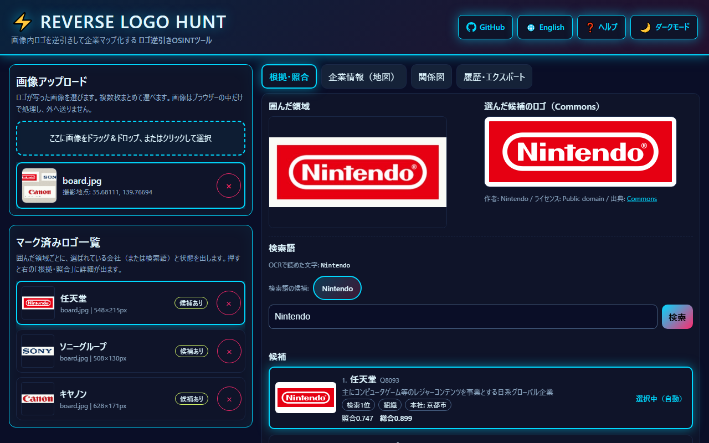
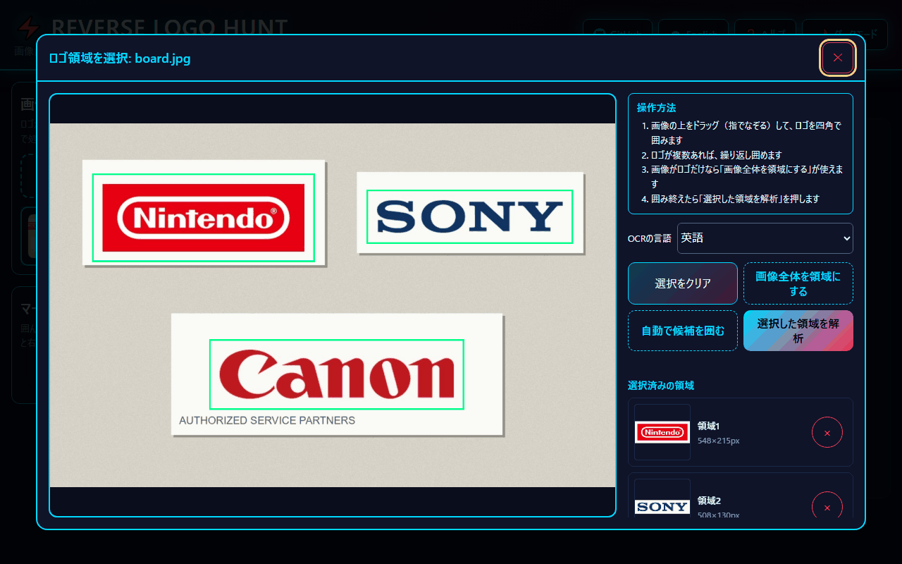
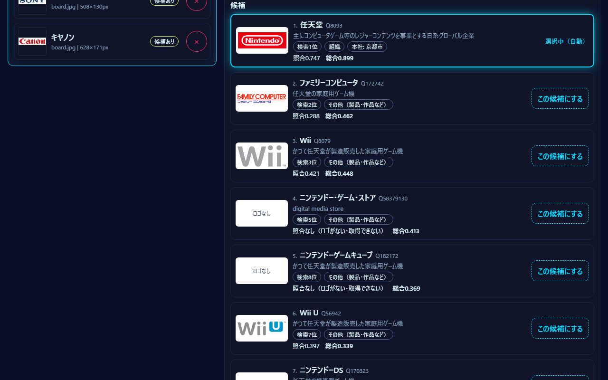
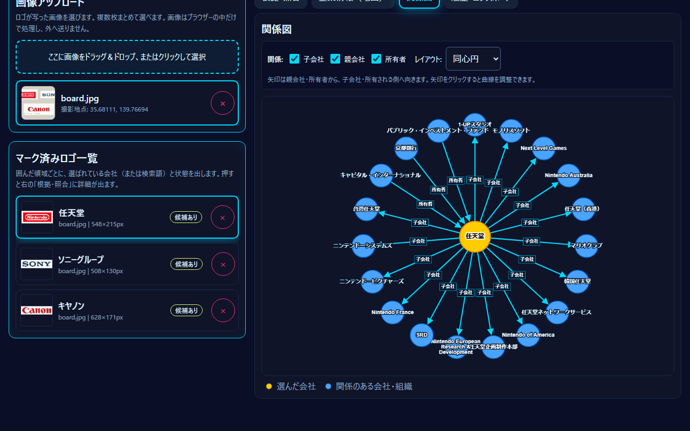
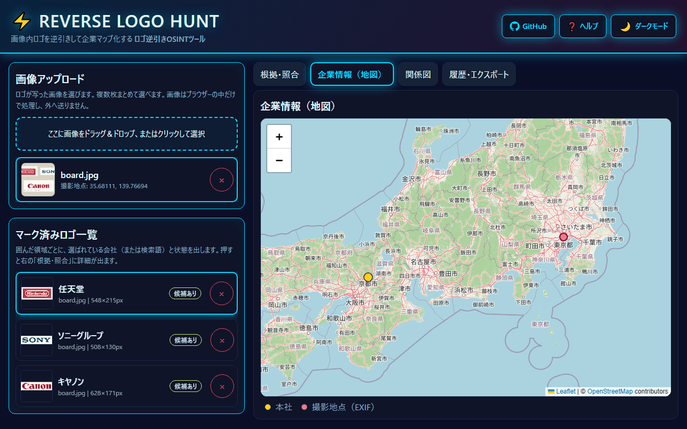
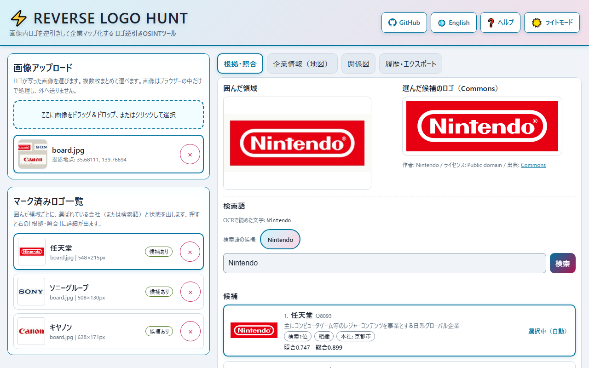

<!--
---
id: day091
slug: reverse-logo-hunt

title: "Reverse Logo Hunt"

subtitle_ja: "ロゴを逆引きして企業マップ化するOSINTツール"
subtitle_en: "OSINT tool for reverse logo lookup and corporate relationship mapping"

description_ja: "画像に写ったロゴを囲むと、OCRで読んだ文字でWikidataを検索し、候補ごとにWikimedia Commonsの公式ロゴと形・明暗・縦横比・色を照合して並べる。人が確定した会社の本社と撮影地点を地図に、親会社・子会社・所有者を関係図に出す。画像は外へ送らないクライアントサイド完結型OSINTツール。"
description_en: "Mark a logo in an image; the tool reads its text with OCR, searches Wikidata, and ranks candidates by comparing each with its official logo on Wikimedia Commons (shape, light-dark structure, aspect ratio, colour). The company you confirm is mapped with its headquarters and the photo location, and its parents, subsidiaries and owners are drawn as a graph. Images never leave the browser."

category_ja:
  - OSINT
  - フォレンジック
category_en:
  - OSINT
  - Forensics

difficulty: 2

tags:
  - osint
  - forensics
  - logo-detection
  - wikidata
  - leaflet
  - cytoscape
  - ocr
  - javascript

repo_url: "https://github.com/ipusiron/reverse-logo-hunt"
demo_url: "https://ipusiron.github.io/reverse-logo-hunt/"

hub: true
---
-->

# Reverse Logo Hunt - ロゴを逆引きして企業マップ化するOSINTツール


[](https://ipusiron.github.io/reverse-logo-hunt/)

**Day091 - 生成AIで作るセキュリティツール100**

Reverse Logo Huntは、写真や画像に写り込んだ企業ロゴを手がかりに、その会社をWikidataで逆引きし、本社の場所と親会社・子会社・所有者の関係を地図と関係図にまとめるOSINTツールです。

ロゴを四角で囲むと、OCRで文字を読んでWikidataを検索し、候補ごとにWikimedia Commonsの公式ロゴと見比べて並べます。見た目が似ているだけで決めず、検索の順位・種類（組織かどうか）・ロゴの照合を足し合わせて仮の1位を出し、最後は人が確定します。

画像はブラウザーの中だけで処理し、外へは送りません。商標ロゴの学習データも同梱せず、比べるロゴはその都度Commonsから取得します。

---

## 🌐 デモページ

👉 **[https://ipusiron.github.io/reverse-logo-hunt/](https://ipusiron.github.io/reverse-logo-hunt/)**

ブラウザーで直接お試しいただけます。

---

## 📸 スクリーンショット

>
>
>*3つのロゴを囲んで解析した結果（任天堂を選択中）*

>
>
>*ロゴを四角で囲む画面（マウス・タッチ・ペンで囲める）*

>
>
>*「SONY」で検索した候補の一覧（検索の順位・種類・照合・総合）*

>
>
>*関係図（矢印は親会社・所有者から子会社・所有される側へ）*

>
>
>*本社（京都市）と撮影地点（EXIF、東京駅付近）*

>
>
>*ライトモード*

スクリーンショットの看板は、Wikimedia Commonsのパブリックドメインのロゴを撮影用の画像に置いたものです。

---

## ✨ 機能

- ロゴを囲む: マウス・タッチ・ペンでドラッグして四角で囲む。「画像全体を領域にする」「自動で候補を囲む」（文字やロゴのまとまりを語の単位で囲む）も使える
- 文字を読む: Tesseract.js（WASM）でOCR。読めなかったときは、ロゴの札だけに切り詰め、字を囲む枠を取り除いて読み直す
- 検索語を選ぶ・直す: OCRの結果から検索語の候補を最大5つ作る（BMW・HP・3Mのような短い略称や日本語も捨てない）。文字のないロゴや読み違いは、欄に手で入れて検索し直せる
- 候補を並べる: Wikidataの検索（wbsearchentities）の上位8件について、ロゴ・本社所在地・種類を引き、ロゴのある候補（最大6件）をCommonsの公式ロゴと照合する
- 人が確定する: 検索の順位・種類・照合を足した総合で仮の1位を出す。1位と2位の差が0.05未満なら確かめるよう促す。どの候補にでも切り替えられる
- 地図: 選んだ会社の本社と、画像の撮影地点（EXIFのGPS）を同じ地図に出す
- 関係図: 親会社（P749）・子会社（P355）・所有者（P127）を、親・所有者から子へ向く矢印で描く。種類ごとの表示の切り替え、配置の切り替え、矢印の曲線の調整
- 書き出し: 画像・囲んだ領域・候補・選んだ会社をJSONに保存して読み込み直せる。囲みの枠と会社名を描いたPNGも出力できる
- 画面: ダーク・ライトの2テーマ、スマートフォンの幅、キーボード操作

### 📐 画面構成

| 場所 | 内容 |
|:--|:--|
| 画像アップロード（左） | 画像の読み込み、読み込んだ画像の一覧（撮影地点の有無） |
| マーク済みロゴ一覧（左） | 囲んだ領域ごとの、選ばれている会社と状態（候補あり・候補なし・検索語なし・エラー） |
| 根拠・照合タブ | 囲んだ領域と選んだ候補のロゴ（作者・ライセンス・出典）、検索語、候補の一覧、点数の内訳 |
| 企業情報（地図）タブ | 選んだ会社の本社と、画像の撮影地点 |
| 関係図タブ | 選んだ会社の親会社・子会社・所有者。種類ごとの表示の切り替え、配置（同心円・フォース・階層・円形）、矢印の曲線の調整 |
| 履歴・エクスポートタブ | 解析の履歴（画像の名前と件数）、JSONの書き出しと読み込み、枠を描いたPNGの出力 |

関係図の矢印を押すと、その矢印の曲線の形（ベジェ曲線・自由ベジェ・直線・折れ線）、曲線の強さ、制御点の位置を変えられます。「すべての矢印に適用」で同じ形にそろえられます。

### 🔄 手作業での調べものとの違い

| 作業 | 手作業 | 本ツール |
|:--|:--|:--|
| 複数のロゴ | 1つずつ画像検索・百科事典で調べる | 1枚の画像の中で囲んで、まとめて解析する |
| 会社の特定 | 名前の似た会社・製品を取り違えやすい | 候補を並べ、検索の順位・種類・照合の内訳を見て選ぶ |
| 公式ロゴとの見比べ | 目視 | 形・明暗の構造・縦横比・色を数値で出す（目安） |
| 本社の場所・関係 | 会社ごとに別々に調べる | Wikidataから本社・親会社・子会社・所有者を引いて地図と関係図にする |
| 出典 | 手でメモする | Commonsの作者・ライセンス・出典ページを表示し、JSONにも残す |
| 画像の扱い | 画像検索に送ることが多い | 画像を外へ送らない |

---

## 📖 使い方

1. 画像をドラッグ＆ドロップするか、クリックして選びます（複数枚まとめて選べます）
2. 開いた画面で、ロゴを四角で囲みます。ロゴが複数あれば繰り返し囲めます
3. 「選択した領域を解析」を押します。文字を読み、Wikidataを検索し、候補ごとにCommonsのロゴと照合します
4. 「根拠・照合」タブで候補の一覧を見比べます。仮の1位が違っていれば、正しい候補の「この候補にする」を押します
5. 「企業情報（地図）」で本社と撮影地点を、「関係図」で親会社・子会社・所有者を見ます
6. 「履歴・エクスポート」でJSONを書き出す（読み込み直せる）か、枠を描いたPNGを出力します

うまくいかないときは、次を試してください。

- 文字のないロゴ（記号だけのロゴ）・OCRの読み違い・日本語の看板: 「検索語」の欄に会社名やブランド名を入れて「検索」を押す
- 候補に目的の会社が出ない: 正式名・英語名・略称で検索し直す
- 1位が子会社や製品になる: 一覧で親会社（種類が「組織」、検索の順位が上）を選ぶ

### 精度を上げるコツ

- 会社からの封書・請求書・パンフレット・名刺・社用封筒・製品パッケージのように、背景が単純でロゴがはっきり印刷された画像が向いている
- ロゴの周りに少し余白をとって囲む（照合は、囲んだ領域の外周の色を背景とみなすため）
- 1つの四角には1つのロゴだけを入れる。社名とスローガンが並ぶときは社名だけを囲むと、検索語が絞られる
- 大きな画像は長辺1536pxまで縮めて扱う。小さく写ったロゴは、元の画像を切り抜いてから読み込むと読みやすくなる

### 例: 任天堂のロゴ

スクリーンショットの看板で、任天堂のロゴ（赤い札に白い字）を囲んだときの流れです（2026-10-09の実測）。

1. 1回目のOCRでは字を読めず、札だけに切り詰めて枠を取り除いた読み直しで「Nintendo」と読めた
2. 「Nintendo」でWikidataを検索すると、任天堂（Q8093）が検索1位、種類は組織、本社は京都市
3. Commonsのロゴ（Nintendo.svg、パブリックドメイン）との照合の合計は0.747、総合は0.899で、仮の1位になった
4. 関係図には、子会社16社と所有者3者（キャピタル・インターナショナル、京都銀行、パブリック・インベストメント・ファンド）が出た。親会社はWikidataに書かれていない

Wikidataの内容は日々更新されるので、件数や順位は変わることがあります。

### ⌨️ キーボード

| キー | 動き |
|:--|:--|
| `1`〜`4` | タブを切り替える（入力欄にいるときは切り替えない） |
| `←` / `→` | タブにいるとき、隣のタブへ移る |
| `Esc` | ヘルプ・ロゴを囲む画面を閉じる |

---

## 🔬 しくみ

### 解析の流れ

1. 囲んだ領域をOCRに渡す（小さい領域は高さ120pxまで拡大し、暗い地の白抜きは明暗を反転する）
2. 読んだ文字から検索語の候補を作る（文字の高さと確からしさがあれば、大きく確かな語を先にする）
3. Wikidataの`wbsearchentities`で検索する。検索の順位をそのまま残す
4. 上位8件について、SPARQLでロゴ（P154）・本社所在地（P159）の座標（P625）・種類を引く。SPARQLに入れるのは検証したQIDだけで、利用者の文字列は入れない
5. ロゴのある候補（最大6件）について、Commonsから幅330pxのサムネイルを取得し、囲んだ領域と照合する
6. 総合の高い順に並べ、1位を仮に選ぶ

### ロゴの照合（形・明暗の構造・縦横比・色）

囲んだ領域は外周の色を背景とみなし、背景との差がある部分を前景（ロゴ）として取り出します。Commonsのロゴは透明な背景のものが多いので、透明度で前景を決めます（端まで色が塗られたロゴは画像全体を前景にします）。そのうえで次の4つを別々に比べます。

| 値 | 比べるもの | 重み |
|:--|:--|:--:|
| 形 | 前景の外接矩形を32×32の格子に収めた「前景の割合」の重なり | 0.35 |
| 明暗の構造 | 外接矩形の中の明るさの並び（24×24）の相関の絶対値。白抜きの看板にも使える | 0.25 |
| 縦横比 | 前景の外接矩形の縦横比の近さ | 0.15 |
| 色 | 前景の画素だけの色相12区分と無彩色1区分の分布の近さ（白と黒は区別しない） | 0.25 |

照合の合計は、この重みで足した値（0〜1）です。

### 候補の並べ方（総合）

ロゴの見た目だけでは会社を決めません。子会社のロゴが親会社のロゴを中に含むことがあり、見た目では子会社のほうが近く出ることがあるためです。

総合 = 0.4×検索の順位の点 + 0.2×種類の点 + 0.4×照合の合計

- 検索の順位の点: 1位が1、2位が0.667、3位が0.5、4位が0.4（1÷(1+0.5×(順位−1))）
- 種類の点: 組織（本社所在地・業種・親会社・子会社・所有者のどれかを持つ項目）かブランドなら1、それ以外（製品・作品など）は0.4
- 照合の合計: ロゴがない・取得できない候補は0.5（判断の材料がない）とみなす

### 照合の当たり具合

Commonsのパブリックドメインのロゴ16社について、紙に印刷したもの・4°傾けて灰色の地に置いたもの・暗い地の看板（黒い部分を白抜き）の3通りの写真風の画像を作り、21社のロゴの中から本物が1位になる割合を測りました（2026-10-09、作業側の評価。ロゴの画像はリポジトリに入れていません）。

| 集合 | 本ツール | 照合を作り直す前の方式 |
|:--|:--:|:--:|
| 重みを決めるのに使った8社（任天堂・ソニーグループ・トヨタ・キヤノン・パナソニック・Google・Apple・BMW） | 22/24 | 6/24 |
| 重みを決めるのに使っていない8社（ホンダ・サムスン・インテル・マイクロソフト・スターバックス・IBM・アディダス・シェル） | 24/24 | 5/24 |

外した2枚は、任天堂の紙と傾きの画像で、任天堂のロゴを中に含むNintendo Software Technologyのロゴと、赤い文字のShellのロゴに僅差で負けたものです。実際の画面では検索語で候補が絞られ、検索の順位も足すので、任天堂が1位になります（下の「このツールならではの使い方」の2つ目）。

この評価は、ロゴそのものを少し加工した画像での値です。実際の写真では、遠近の歪み・光の反射・汚れ・一部が隠れることで値が下がります。

### 外部との通信

| 通信先 | 何を送るか | 何に使うか |
|:--|:--|:--|
| www.wikidata.org | 検索語 | 候補の検索 |
| query.wikidata.org | 候補のQID | ロゴ・本社・種類・関係の取得（SPARQL） |
| commons.wikimedia.org | ロゴのファイル名 | サムネイルのURLと作者・ライセンス |
| thumb.wikimedia.org / upload.wikimedia.org | なし（画像の取得） | ロゴのサムネイル |
| tile.openstreetmap.org | 地図の位置（タイルの番号） | 地図のタイル |
| unpkg.com / cdn.jsdelivr.net | なし（取得だけ） | 版を固定したライブラリーとOCRの言語データ |

画像そのもの、囲んだ領域、OCRで読んだ全文、撮影地点は送りません。Wikidata・Commonsの応答はブラウザーのIndexedDBに24時間だけ残し、同じ検索を速くします。

---

## 🎯 ユースケース

### このツールならではの使い方

- 偽ロゴ・パロディ商品の見分けの練習: 照合の内訳は形・明暗の構造・縦横比・色を別々に出します。形を同じにして色だけ変えた図形では、形・明暗の構造・縦横比が1.000のまま色だけが0.000に下がり、照合の合計は0.750になります（本物は1.000）。どこが本物と違うのかを数値で言えるので、フィッシングの偽ブランドや模倣品の教材になります
- 「見た目が一番近い」が正解とは限らないことを学ぶ: 紙に印刷した任天堂のロゴは、見た目の照合だけなら子会社Nintendo Software Technology（0.790）が任天堂（0.753）を上回りました（2026-10-09の実測）。検索の順位と種類を足すと、任天堂が0.901、子会社が0.649になります。OSINTで「似ている」を証拠にする前に、別の手がかりと組み合わせる理由を体験できます
- 白抜きの看板と元のロゴを同じものとして扱う: 明暗の構造は相関の絶対値で、色は白と黒を区別しないので、黒い輪を暗い地に白で描いた図形も、元の黒い輪と照合の合計1.000になります。夜の看板・ネオン・反転した印刷物でも、元のロゴと見比べられます
- 候補の一覧を「名前の衝突」の観察に使う: 「SONY」で検索すると、ソニーグループのほかにソニー・ミュージック、ソニーBMG、PlayStation 3なども並びます（2026-10-09）。同じ名前を持つ組織・製品の広がりを見ることは、なりすましドメインやブランドの監視の下調べになります

### 調査・セキュリティ

- 現地写真・SNSの画像から、写り込んだ看板・車両・制服のロゴを拾い、関係する会社と本社の場所をまとめる
- 報道写真・投稿画像のロゴを公式ロゴと見比べ、古いデザインや改変の可能性を確かめる手がかりにする（照合の値だけで改変を断定しない）
- サプライチェーンの事故調査で、部品・包装のロゴから会社を引き、親会社・所有者をたどる
- 自社や取引先の公開写真から、どの協力会社のロゴが外から見えるかを洗い出し、公開情報の露出を点検する
- フィッシングサイトや広告のスクリーンショットに写るロゴを公式ロゴと比べる教材にする
- OSINT系CTFの写真問題で、背景のロゴから会社と本社を引き、撮影場所の絞り込みの手がかりにする。自作の問題作りにも使える
- 物理セキュリティの点検で、防犯カメラの画像に写る作業服・車両のロゴから所属の会社を引き、立ち入りの権限と突き合わせる
- 施設の周りの公開写真（地図サービスの写真やSNS）から、どの協力業者の看板や車両が見えるかを洗い出す
- 評価のあとの報告会で、「公開写真からここまでわかる」を本ツールで実演し、写真の公開のしかたを見直すきっかけにする

### 想定する利用者

- OSINTアナリスト・脅威インテリジェンスの担当者: 公開情報から会社の関係を図にしたい人
- デジタルフォレンジックの調査員: 証拠の画像に写った会社の痕跡を整理したい人
- インシデント対応・サプライチェーンの担当者: 事故に関わる会社と親会社をたどりたい人
- 調査報道の記者・ファクトチェッカー: 写真の看板や製品から会社を裏づけたい人
- セキュリティの講師・CTFの出題者・学生: OSINTの演習の教材や問題を作りたい人
- オープンデータに関心のある人: WikidataとCommonsの実際の使い方を見たい人

### 教育・研究

- 情報セキュリティやメディアリテラシーの授業で、「画像からどこまでわかるか」を実演する（画像は外へ送らない）
- オープンデータ（Wikidata・Commons）の使い方、SPARQL、出典とライセンスの表示を学ぶ教材にする
- 経営学・経済学のゼミで、身近な商品のロゴから親会社・所有者をたどり、企業グループや持ち株の構造を図にする
- 画像処理の入門として、背景の推定・前景の取り出し・形と色の比べ方を、数値の内訳つきで観察する

### 暮らし・趣味

- 旅行の写真に写った看板から、その会社の本社がどこにあるかを地図で見る
- 家にある家電・食品のブランドが、どの親会社に属しているかを調べる
- 古い広告やチラシのロゴを今の公式ロゴと見比べ、デザインの変遷を楽しむ
- 謎解き・脱出ゲームの問題作りで、ロゴの写真から会社や場所をたどる仕掛けを作る

### 組み合わせ

- 撮影地点や位置情報の検証には、写真のEXIFや太陽の位置を扱うツール（WhereShotなど、このシリーズのツール）と組み合わせる
- 書き出したJSONを、報告書や他の分析ツールに手で取り込む（形式は「しくみ」と`js/session-core.js`を参照）

本ツールは公開情報の調べものを助ける道具です。他人を害する目的での利用は勧めません。

---

## ⚠️ 限界と注意

- 会社を決めるのは人です。総合の1位は仮のもので、ロゴと説明を見比べて確かめてください
- 照合の値は「見た目の近さの目安」です。改変・偽造・合成の証明には使えません
- Wikidataにロゴ（P154）がない会社は照合できません（候補には出ます）。本社の座標がない会社は地図に出ません
- 関係図はWikidataに書かれている関係だけを出します。終わった関係や持ち株の比率は区別していません
- OCRは英語の文字だけを読みます。日本語の看板は検索語を手で入れてください
- 文字のないロゴ（記号だけ）は、検索語を手で入れる必要があります
- 写真の遠近の歪み・反射・汚れ・一部が隠れたロゴでは、照合の値が下がります
- 商標・ロゴは各権利者に帰属します。Commonsの画像を再利用するときは、表示される作者とライセンスに従ってください
- 取得したデータを自動で大量に集めたり、再配布したりしないでください

---

## 🔒 セキュリティとプライバシー

- 画像・囲んだ領域・OCRの全文・撮影地点は外へ送りません
- Content Security Policyを`default-src 'self'`から始めて、通信先を上の表の範囲に限っています。`'unsafe-inline'`と`'unsafe-eval'`は使いません（OCRのWASMのために`'wasm-unsafe-eval'`だけを許可）
- 外部のライブラリーは版を固定し、`<script>`にSubresource Integrity（SRI）を付けています
- Commonsの作者名はHTMLで返るので、文字だけを取り出して表示します。外部から来た文字列はすべて`textContent`で入れ、HTMLとして解釈させません
- 読み込むJSONは、知っている項目だけを型と範囲を確かめて組み直します（画像は`data:image`のBase64だけ、URLはCommonsのものだけ）
- localStorageには表示のテーマと履歴（画像の名前と件数だけ）を残します。使えない環境でも止まりません

---

## ❓ FAQ

Q. 画像はどこかへアップロードされますか？
A. されません。OCRもロゴの照合もブラウザーの中で行います。外へ送るのは検索語と、候補のQID・ロゴのファイル名だけです。

Q. Google Lensのような画像検索とどう違いますか？
A. 画像をサーバーへ送らないこと、候補ごとに根拠（検索の順位・種類・照合の内訳）を出して人が確定すること、確定した会社の本社と関係をオープンデータから地図と関係図にすることです。その代わり、文字の読めないロゴは検索語を手で入れる必要があります。

Q. 関係図に古い子会社が出ます。
A. Wikidataに書かれている関係をそのまま出しているためです。関係が今も続いているかは、Wikidataの項目で確かめてください。

---

## 📁 ディレクトリー構造

```
reverse-logo-hunt/
├── .github/                        # GitHub の設定
│   └── workflows/                  # GitHub Actions
│       └── test.yml                # push・pull_requestのたびにnpm testを回す
├── assets/                         # READMEのスクリーンショット
│   ├── screenshot.png              # 3つのロゴを解析した結果
│   ├── screenshot-candidates.png   # 候補の一覧
│   ├── screenshot-graph.png        # 関係図
│   ├── screenshot-light.png        # ライトモード
│   ├── screenshot-map.png          # 本社と撮影地点の地図
│   └── screenshot-marking.png      # ロゴを囲む画面
├── js/                             # 画面と計算部（ES modules）
│   ├── analysis.js                 # 検索→詳細→ロゴの照合→並べ替え（通信と画像の読み込み）
│   ├── brand-text.js               # OCRの文字から検索語の候補を作る（計算部）
│   ├── cache.js                    # IndexedDBの24時間キャッシュ
│   ├── candidate-rank.js           # 検索の順位・種類・照合から総合を出して並べる（計算部）
│   ├── commons-core.js             # Commonsの問い合わせの組み立てと解析（計算部）
│   ├── commons.js                  # Commonsへの問い合わせ（通信とキャッシュ）
│   ├── exif-core.js                # EXIFのGPSを緯度・経度にする（計算部）
│   ├── exif.js                     # ExifReaderで撮影地点を読む
│   ├── graph.js                    # 関係図（Cytoscape.js）
│   ├── group-core.js               # 共通の親を見つける（計算部）
│   ├── logo-match.js               # ロゴの照合：形・明暗の構造・縦横比・色（計算部）
│   ├── main.js                     # 画面の組み立てと操作
│   ├── map.js                      # 地図（LeafletとOpenStreetMap）
│   ├── marking.js                  # ロゴを囲む画面（Pointer Events）
│   ├── messages.js                 # 画面の文言の辞書
│   ├── ocr-prep.js                 # OCRの前の拡大・反転・枠の除去（計算部）
│   ├── ocr.js                      # Tesseract.jsで文字を読む
│   ├── roi-suggest.js              # 「自動で候補を囲む」（計算部）
│   ├── session-core.js             # JSONの書き出しと読み込みの検証（計算部）
│   ├── storage.js                  # localStorageを使えなくても止まらない読み書き
│   ├── wikidata-core.js            # Wikidataの問い合わせの組み立てと解析（計算部）
│   └── wikidata.js                 # Wikidataへの問い合わせ（通信とキャッシュ）
├── test/                           # node --test のテスト
│   ├── fixtures/                   # 実際のAPIの応答（2026-10-09、WikidataはCC0）
│   │   ├── ancestors-group.json    # ユニクロ・ジーユー・レクサス・ダイハツ・トヨタの親と所有者
│   │   ├── details-nintendo.json   # 「nintendo」の上位8件の詳細（SPARQL）
│   │   ├── imageinfo-nintendo-sony.json # Commonsのimageinfo（任天堂・ソニーグループ）
│   │   ├── relations-Q8093.json    # 任天堂の関係（SPARQL）
│   │   └── search-nintendo.json    # 「nintendo」の検索結果（wbsearchentities）
│   ├── brand-text.test.js          # 検索語の候補のテスト
│   ├── candidate-rank.test.js      # 総合と並べ方のテスト
│   ├── commons-core.test.js        # Commonsの解析のテスト
│   ├── contrast.test.js            # 配色のコントラスト比のテスト
│   ├── exif-core.test.js           # GPSの読み取りのテスト
│   ├── format.test.js              # 書式（行の長さ・見えない文字）のテスト
│   ├── group-core.test.js          # 共通の親のテスト
│   ├── html.test.js                # index.htmlのCSP・SRI・要素のテスト
│   ├── logo-match.test.js          # ロゴの照合のテスト
│   ├── ocr-prep.test.js            # OCRの前処理のテスト
│   ├── readme.test.js              # READMEの数値・構造のテスト
│   ├── roi-suggest.test.js         # 自動で囲む処理のテスト
│   ├── session-core.test.js        # JSONの検証のテスト
│   ├── synthetic.js                # テスト用の合成画像（実在のロゴは使わない）
│   └── wikidata-core.test.js       # Wikidataの解析のテスト
├── .gitignore                      # Gitに入れないファイル
├── .nojekyll                       # GitHub PagesでJekyllを使わない
├── AGENTS.md                       # AIエージェント向けの作業の決まり
├── CLAUDE.md                       # Claude Code向けのプロジェクト情報
├── LICENSE                         # MITライセンス
├── README.md                       # このファイル
├── TECHNICAL.md                    # 技術的な説明（開発者向け）
├── index.html                      # 画面
├── package.json                    # npm testの設定（依存なし）
└── style.css                       # スタイル（ダーク・ライト）
```

---

## 🧪 テスト

```bash
npm test
```

- Node.js 22以上で動きます。依存パッケージはありません（`node --test`）
- GitHub Actionsでpushとpull requestのたびに自動で実行します
- 計算部（照合・検索語・Wikidata・Commons・EXIF・候補の並べ方・JSONの検証・自動で囲む処理・OCRの前処理）を、合成画像と実際のAPIの応答で検査します
- READMEの数値（照合の内訳・総合・重み・任天堂の関係の数）も計算部とテストの材料から計算し直して照らし合わせます

---

## 💻 動作環境

- ブラウザー: Chrome・Edge・Firefoxの最新版（WebAssemblyとES modulesが必要）
- ネットワーク: Wikidata・Commons・OpenStreetMap・CDNへの接続が必要
- ローカルで動かすときは、HTTPサーバーで配信してください（Chrome・Edgeは`file://`のページからES modulesを読み込みません。Firefoxは`file://`でも画面は開きます）

```bash
python -m http.server 8000
# http://localhost:8000/ を開く
```

---

## 📄 ライセンス

- ソースコードはMIT Licenseです。詳細は [LICENSE](LICENSE) を参照してください
- [Leaflet](https://leafletjs.com/)（BSD-2-Clause）、[Cytoscape.js](https://js.cytoscape.org/)（MIT）、[Tesseract.js](https://github.com/naptha/tesseract.js)（Apache-2.0）、[ExifReader](https://github.com/mattiasw/ExifReader)（MPL-2.0）を利用しています
- 地図は「© OpenStreetMap contributors」、データはWikidata（CC0）、ロゴ画像はWikimedia Commons（ファイルごとのライセンスを画面に表示）です

---

## 🛠️ このツールについて

本ツールは、「生成AIで作るセキュリティツール100」プロジェクトの一環として開発されました。
このプロジェクトでは、AIの支援を活用しながら、セキュリティに関連するさまざまなツールを100日間にわたり制作・公開していく取り組みを行っています。

プロジェクトの詳細や他のツールについては、以下のページをご覧ください。

🔗 [https://akademeia.info/?page_id=42163](https://akademeia.info/?page_id=42163)
