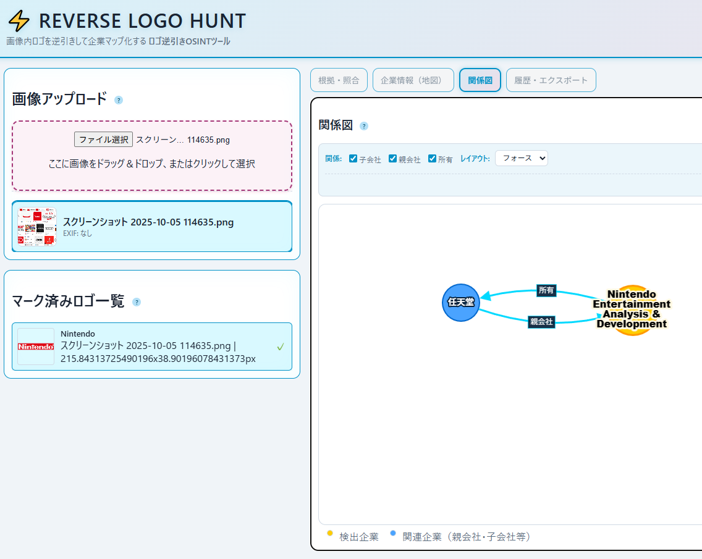

<!--
---
title: Reverse Logo Hunt
category: osint-tools
difficulty: 3
description: Detect logos in images and map corporate relationships using client-side analysis.
tags: [osint, forensics, logo-detection, map, javascript]
demo: https://ipusiron.github.io/reverse-logo-hunt/
---
-->

# Reverse Logo Hunt – ロゴを逆引きして企業マップ化するOSINTツール


[](https://ipusiron.github.io/reverse-logo-hunt/)

**Day091 - 生成AIで作るセキュリティツール100**

**Reverse Logo Hunt** は、画像のロゴを逆引きして企業マップ化するOSINTツールです。

写真や画像データに写り込んだ **企業ロゴ** を手動でマークし、OCR・画像照合を経て企業を特定します。
企業の **本社・拠点**、**関係企業ネットワーク** を地図/グラフで可視化します。

ブラウザー内で完結し、ユーザーの画像は外部に送信されません。
また、**商標ロゴの学習データを同梱せず** 、必要なロゴ画像は **Wikidata / Commons から都度取得** します。

---


## 🌐 デモページ

👉 **[https://ipusiron.github.io/reverse-logo-hunt/](https://ipusiron.github.io/reverse-logo-hunt/)**

ブラウザーで直接お試しいただけます。

---

## 📸 スクリーンショット

>
>*任天堂ロゴを解析した結果とその関連会社の関連図*

---

## 🧭 特長

- **100%クライアントサイド動作**（GitHub Pagesで稼働可）
- **ロゴ → 企業 → HQ/関係マップ** の流れを自動化
- **Wikidata / Commons** から企業ロゴ・拠点・関係をリアルタイム取得
- **プライバシー保護設計**：アップロード画像は外部に送信されない
- **出典明示**：すべてのロゴ画像にCommonsの出典・ライセンスを自動表示
- **教育用途最適**：OSINT・フォレンジック・地理情報の統合体験ツール
- **セキュリティ強化**：SRI (Subresource Integrity)、XSS対策、CSP適用済み

---

## 👥 対象ユーザー

本ツールは以下のような方々に最適です：

### 🕵️ セキュリティ・調査関係者
- **OSINTアナリスト**: 公開情報から企業関係を可視化したい方
- **デジタルフォレンジック調査員**: 証拠画像中の企業痕跡を特定したい方
- **脅威インテリジェンスアナリスト**: 企業ネットワークを地理的に分析したい方
- **レッドチーム・ペンテスター**: ターゲット組織の関連企業をマッピングしたい方
- **インシデントレスポンダー**: サプライチェーン事故の関連企業を追跡したい方

### 🎓 教育・研修関係者
- **セキュリティ講師**: OSINT・フォレンジックの実習教材を探している方
- **CTF出題者**: リアルなOSINT問題を作成したい方
- **大学・専門学校教員**: データサイエンス・情報セキュリティの演習課題を探している方
- **企業研修担当者**: セキュリティ意識向上のためのデモツールを探している方

### 📊 ジャーナリスト・研究者
- **調査報道記者**: 企業関係を裏付けるデータソースを必要とする方
- **学術研究者**: 企業ネットワーク分析の視覚化ツールを探している方
- **ファクトチェッカー**: SNS画像の真偽検証に活用したい方

### 🎯 セキュリティ愛好家・学習者
- **CTF参加者**: OSINT系問題の解法ツールを探している方
- **セキュリティ初学者**: 実践的なOSINT分析を体験したい方
- **オープンデータ活用者**: Wikidata/Commonsの実用例を学びたい方

### ⚠️ 非推奨の用途
- **商用スクレイピング**: ロゴの自動収集・再配布は禁止されています
- **プライバシー侵害**: 個人のSNS画像の無断解析は倫理的に問題があります
- **攻撃的セキュリティ**: 防御目的以外の使用は推奨されません

---

## 💡 手動検索と比べた本ツールの優位性

### 🔍 手動でロゴを目視検索する場合
1. ロゴを1つずつ目視で確認
2. Google画像検索やWikipediaで企業名を調べる
3. 企業の本社・拠点を個別に検索
4. 親会社・子会社の関係を手動で調査
5. 結果をメモやスプレッドシートに手入力
6. 複数ロゴがある場合は上記を繰り返し

**⏱️ 推定時間**: 1ロゴあたり5-10分 × ロゴ数

### ⚡ 本ツールを使う場合
1. 画像をアップロードして複数ロゴを一括マーキング
2. OCR + Wikidata検索 + 類似度計算を自動実行
3. 親会社・子会社の関係図を自動生成（Cytoscape.js）
4. 本社・拠点を地図上に自動プロット（Leaflet）
5. EXIF位置情報との地理的関連を自動比較
6. JSON/PNG形式でエクスポート可能

**⏱️ 推定時間**: 1ロゴあたり30秒-1分 × ロゴ数（並列処理）

### 🎯 具体的な優位性

| 機能 | 手動検索 | 本ツール |
|:--|:--:|:--:|
| **複数ロゴの一括処理** | ❌ 1つずつ | ✅ まとめて選択→自動解析 |
| **関係図の自動生成** | ❌ 手動調査 | ✅ Wikidataから自動取得 |
| **地理的マッピング** | ❌ 個別検索 | ✅ 本社・拠点を自動プロット |
| **客観的類似度評価** | ❌ 目視判断 | ✅ pHash/色相/ORBで定量化 |
| **出典の自動明示** | ❌ 手動記録 | ✅ Commons出典を自動付記 |
| **履歴とエクスポート** | ❌ 手入力 | ✅ JSON/PNG自動生成 |

### 📋 最適な利用シーン

- **封書・請求書・パンフレット**: 複数企業ロゴが印刷された書類の一括OSINT分析
- **街角・施設写真**: 看板・ポスター・製品ロゴが複数写った画像の企業マッピング
- **SNS・報道画像**: 写り込んだロゴから撮影場所・関係企業を特定
- **フォレンジック調査**: 証拠画像中の企業痕跡を体系的に抽出・可視化

---

## 🎯 Reverse Logo Huntの活用シナリオ

### 🕵️‍♂️ OSINT（オープンソース情報分析）への応用

#### 1. 現地写真・SNS画像からの企業活動推定
- 撮影地・街角・工事現場・イベント写真などに映り込んだロゴを手動選択して検出。
- 取得した企業情報から **現場に関わる組織・ブランド構成** を推定。  
- EXIFの座標と組み合わせることで、**企業の活動エリアや市場進出状況** を地理的に分析。  
  → 例：「この撮影地点には複数の特定企業ロゴが見られる＝共同事業の可能性」

#### 2. メディア画像の真偽・出所検証
- 報道写真やSNS投稿画像に写る看板・製品ロゴから **撮影場所や所属企業を特定**。  
- Commonsから取得した公式ロゴとの類似度比較により、**改変・合成の有無** を推定。  
  → 例：「ロゴ形状が最新デザインでない＝過去画像の再利用かもしれない」

#### 3. OSINT報告書の作成支援
- 企業名を手動で調べる手間を省き、**画像→企業→関係図** の流れを効率化。
- Wikidataの親子関係情報をそのまま引用でき、**報告書のファクト裏付け** に利用可能。
- JSON/PNG出力機能により解析結果を報告書に直接添付可能。  

---

### 🔬 デジタル・フォレンジックへの応用

#### 1. 証拠画像中の「企業痕跡」特定
- 訴訟・調査案件などで押収した写真・スクリーンショットを分析し、  
  背景や製品ラベルから**関係企業の存在**を明らかにする。  
  → 例：「機密工場内部の画像に別企業のロゴが写り込んでいる」

#### 2. 企業リーク画像の真正性検証
- 投稿者が「社内資料」だと主張する画像に対し、ロゴ形状を検証。  
- Commons上の公式ロゴと一致しない場合、**偽造や古い資料**の可能性を提示。  

#### 3. サプライチェーン事故調査の補助
- 破損製品・包装・部材などの写真からロゴを抽出し、  
  Wikidata経由でサプライヤー企業を特定。  
  → 例：「事故現場の部品ロゴから下請け企業を逆引き」

---

### 🛡️ 他のセキュリティ領域への展開

#### 1. ブランドなりすまし・フィッシング対策
- 偽サイトや広告バナーのスクリーンショットを分析し、  
  表示ロゴが公式Commonsロゴと異なる場合に **“改変検知”**。  
- “ロゴ偽装型フィッシング” の教育教材として利用可能。

#### 2. 物理セキュリティ・インシデント分析
- 防犯カメラ画像に映る **作業服・車両・看板ロゴ** を抽出。  
- 所属企業・下請け業者を推定し、**立入権限の検証** に利用。  

#### 3. OSINT訓練プログラムの教材
- 受講者に「ある写真群から企業活動を再構築する」課題を出す際、  
  本ツールを使って半自動的にロゴを拾い、裏付けデータを取得。  
- 商標・著作権リスクを回避しつつ、**リアルな分析演習**が可能。

#### 4. サイバー脅威インテリジェンスとの統合
- 企業ロゴから Wikidata 経由でドメイン・ブランド情報を取得し、
  OSINTプラットフォーム（MISP, Maltego, SpiderFoot等）に**ノードとして輸出**。
- 組織間の攻撃関連性を"可視的ブランド軸"から補強できる。

---

### 🏁 CTF（Capture The Flag）競技への応用

#### 1. OSINT系CTF問題の解法ツール
- 写真問題で「この画像はどこで撮影されたか？」を解く際、
  背景に映り込んだロゴから **企業名 → 本社所在地** を自動抽出。
  → 例：「看板ロゴからローカル企業を特定 → 拠点住所がフラグのヒント」

#### 2. フォレンジック系問題の補助
- 証拠画像に写る企業ロゴやブランドから **タイムライン再構築** のヒントを取得。
- Wikidataの関係データで「この企業は○○年に買収された」などの時系列情報を補完。

#### 3. ステガノグラフィ・メタデータ解析との組み合わせ
- EXIF座標 + ロゴ検出で **撮影場所の精密特定**。
- 「この企業ロゴが見える場所は世界で3拠点のみ」などの絞り込みに活用。

#### 4. 自作CTF問題の作成支援
- 本ツールを使って「このロゴが写った画像から企業名を特定せよ」といった
  **リアルなOSINT問題**を簡単に作成可能。

---

### ⚔️ レッドチーム演習・セキュリティ評価への応用

#### 1. 組織の公開情報露出度の評価
- 公開写真・SNS・Webサイトから **取引先・協力会社のロゴ** がどの程度見えるかを検出。
- Wikidataの親子関係・所有関係から **サプライチェーン構造** の公開度を可視化。
  → 例：「子会社経由での情報漏洩リスクの発見」

#### 2. 物理セキュリティの防御評価
- Googleストリートビュー、SNS投稿から **施設周辺の協力業者ロゴ** が見える範囲を評価。
- 「どの業者情報が公開されているか」を把握し、**物理セキュリティリスクの可視化** に活用。

#### 3. ブランドなりすまし検知の防御検証
- 防御側として、フィッシング対策のため **公式ロゴと偽装ロゴの類似度** を本ツールで検証。
- 「どこまで改変されると検知できなくなるか」のベースライン測定により防御策を強化。

#### 4. 公開情報分析フェーズの効率化
- 手動でのロゴ選択とOCR処理により、**関係企業の全体像** を短時間で把握。
- レポート作成時に地図・グラフを活用した **視覚的なリスク分析** が可能。

#### 5. セキュリティ評価後のデブリーフィング教材
- 「公開写真からどんな情報が抽出可能か」を
  本ツールで実演し、**OSINT対策の重要性** を組織に啓発。
- JSON/PNG出力機能により評価結果をレポートに添付可能。

---

### 🎓 教育・展示への活用

- セキュリティイベントやオープンデータ講座で  
  「**画像から社会構造を読み解くデモ**」として活用。  
- 大学・専門学校のOSINT授業やフォレンジック実習において、  
  解析過程を体験的に学べるインタラクティブ教材。  

---

### 📝 まとめ

> **Reverse Logo Hunt** は、「企業の痕跡を地図と関係図で追える」  
> 初学者向けの **オープンデータOSINT可視化プラットフォーム** であり、  
> 実践的なフォレンジック・リスク調査・教育訓練に幅広く応用できる。

---

## 💡 使用例

### 🎮 ケーススタディ: Nintendoロゴの検出と企業情報マッピング

実際のツールの動作を、Nintendoを例に見ていきましょう。

#### 準備: ロゴ画像の収集

1. **Wikidataで企業情報を確認**
   - Nintendo (任天堂) のWikidataページ: https://www.wikidata.org/wiki/Q34600
   - このページで確認できる情報:
     - P154: ロゴ画像 → Commons: `Nintendo.svg`
     - P159: 本社所在地 → 京都市南区（座標: 34°58′8″N 135°45′26″E）
     - P355: 子会社 → Nintendo of America, Nintendo EPDなど
     - P749: 親会社 → なし（独立企業）

2. **Google画像検索でロゴを収集**
   - 検索ワード: `"Nintendo logo"` または `"任天堂 ロゴ"`
   - 複数のロゴバリエーションが表示されます:
     - 赤い楕円形の現行ロゴ
     - 旧ロゴ（1970-2006年）
     - 製品ロゴ（Switch、Wii、DS等）
   - スクリーンショットを撮影: 複数のロゴが1枚の画像に写るようにする

#### ツールでの解析手順

**ステップ1: 画像のアップロード**
```
画像ファイル例: nintendo_logos_screenshot.png
サイズ: 1920x1080px（ツールが自動的に1536pxにリサイズ）
```

**ステップ2: ロゴ領域の手動選択**
- フルスクリーンモーダルが表示される
- **マウスをドラッグしてNintendoロゴを矩形選択（手動選択推奨）**
- 複数のロゴがある場合は繰り返し選択可能
- 「AI候補を追加」ボタンでエッジ検出による自動候補も利用可能（補助機能）

**ステップ3: 解析実行**
- 「選択した領域を解析」ボタンをクリック
- 処理の流れ:
  1. **OCR実行** (10-20秒)
     - Tesseract.jsで文字を抽出
     - 検出例: `"NINTENDO"`, `"nintendo"`, `"ニンテンドー"`
  2. **Wikidata検索** (5-10秒)
     - SPARQL検索: `"nintendo"`
     - 候補取得: Nintendo (Q34600), Nintendo Entertainment System (Q172742), etc.
     - ロゴ画像(P154)を持つ候補のみフィルタリング
  3. **類似度計算** (各候補10-20秒)
     - Commons APIでロゴ画像を取得: `File:Nintendo.svg`
     - 3つの指標で類似度を計算:
       - **pHash**: 0.85 (形状が非常に類似)
       - **色相コサイン**: 0.92 (赤色の楕円形が一致)
       - **ORB内点率**: 0.67 (特徴点のマッチング)
     - **総合スコア**: 0.5×0.85 + 0.3×0.92 + 0.2×0.67 = **0.835**

**ステップ4: 結果の確認**

1. **根拠・照合タブ**
   - 左: 選択したROI（検出ロゴ領域）
   - 右: Commonsの公式ロゴ（`File:Nintendo.svg`）
   - スコア表: pHash/色相/ORB/総合スコアを表示
   - 出典情報: 作者・ライセンス（CC BY-SA等）・Commonsページへのリンク

2. **企業情報（地図）タブ**
   - 🔴 HQマーカー: 京都市南区（34.969°N, 135.757°E）
   - 地図上で本社位置を確認
   - EXIF情報があれば撮影地点も同時表示

3. **関係図タブ**
   - 中央ノード（オレンジ）: **Nintendo**
   - 子会社ノード（青）:
     - Nintendo of America (Q170420)
     - Nintendo EPD (Q24053761)
     - Retro Studios (Q598851)
   - エッジ: P355（子会社関係）でグラフ化

4. **履歴・エクスポートタブ**
   - JSON書き出し: 解析結果をJSON形式で保存
   - PNG出力: Bounding Box付き画像をダウンロード

#### 期待される結果

```json
{
  "company": {
    "qid": "Q34600",
    "label": "Nintendo",
    "thumburl": "https://upload.wikimedia.org/wikipedia/commons/thumb/0/0d/Nintendo.svg/320px-Nintendo.svg.png",
    "coord": { "lat": 34.969, "lng": 135.757 }
  },
  "score": {
    "total": 0.835,
    "pHash": 0.85,
    "color": 0.92,
    "orb": 0.67
  }
}
```

#### ⏱️ 処理時間の実測例

- 画像サイズ: 1920x1080px → 1536x864px（リサイズ後）
- ロゴ選択数: 1個
- 合計処理時間: **約45秒**
  - OCR: 15秒
  - Wikidata検索: 8秒
  - Commons照合（候補3件）: 22秒

---

## 📋 クイックスタート：5ステップで始める

### 基本的な使用の流れ

1. **📤 画像をアップロード**
   - 写真をドラッグ＆ドロップ、またはクリックして選択
   - 推奨: 封書・請求書・パンフレット・看板写真など

2. **🎯 ロゴ領域を選択**
   - 表示されたフルスクリーンモーダルでマウスドラッグして矩形選択（**手動選択推奨**）
   - 複数のロゴがある場合は繰り返し選択可能
   - 「AI候補を追加」ボタンでエッジ検出による自動候補も利用可能（補助機能）

3. **🔍 解析を実行**
   - 「選択した領域を解析」ボタンをクリック
   - OCR → Wikidata検索 → 類似度計算が自動実行

4. **📊 結果を確認**
   - **根拠・照合タブ**: ROIとCommonsロゴの比較、類似度スコア
   - **企業情報（地図）タブ**: 本社・拠点の地図表示
   - **関係図タブ**: 親会社・子会社の関係グラフ

5. **💾 結果を保存**
   - JSON書き出し: 解析結果をJSON形式で保存
   - PNG出力: Bounding Box付き画像をダウンロード

---

### 💡 精度向上のコツ

**📧 会社からの封書・請求書・パンフレットなどが最適**
- 背景がシンプルでノイズが少ない
- ロゴが明確に印刷されている
- 文字品質が高くOCRの精度が向上

その他の推奨画像:
- 企業の公式看板・建物外観
- 製品パッケージのクローズアップ
- 名刺・社用封筒

**🎯 ロゴ選択のコツ**
- **手動選択**：マウスドラッグでロゴを正確に囲む（もっとも精度が高い）
- **AI候補**：エッジ検出による自動候補は補助として利用（必要に応じて調整）

### ⌨️ キーボードショートカット

作業効率を向上させるためのショートカットキー：

| キー | 機能 |
|:--|:--|
| `1` | 根拠・照合タブに切り替え |
| `2` | 企業情報（地図）タブに切り替え |
| `3` | 関係図タブに切り替え |
| `4` | 履歴・エクスポートタブに切り替え |
| `←` / `→` | 前の画像 / 次の画像に移動 |
| `Esc` | モーダルを閉じる |

### ⏱️ 処理時間の目安

- **1枚の画像（1ロゴ選択時）**: 約30秒-1分
  - OCR: 10-20秒
  - Wikidata検索: 5-10秒
  - Commons照合 + 類似度計算: 各候補あたり10-20秒

- **複数ロゴを選択した場合**: さらに時間が増加
  - 例: 3つのロゴ → 2-5分程度

**高速化のヒント**:
- 必要なロゴのみを選択（不要な領域を選択しない）
- 画像サイズが大きい場合は事前にリサイズ

---

## 🧱 画面構成

| タブ | 機能概要 |
|:--|:--|
| **画像アップロード** | 画像選択、手動マーキング（モーダル表示）、ROIプレビュー |
| **根拠・照合** | ROI と Commons ロゴの比較、pHash/色/ORBスコア表示 |
| **企業情報（地図）** | WikidataのHQ座標をLeaflet上にピン表示、EXIF位置比較、ヒートマップ表示 |
| **関係図** | Cytoscape.js で親会社・子会社・ブランド関係を可視化、矢印調整機能付き |
| **履歴・エクスポート** | localStorage にセッション履歴、JSON/PNG出力 |

### 🎨 関係図の矢印調整機能

関係図タブでは、企業間の矢印（エッジ）を手動で調整できます：

- **矢印をクリック**すると調整パネルが表示されます
- **曲線スタイル**：ベジェ曲線、直線、セグメントなど選択可能
- **曲線の強さ**：スライダーで曲がり具合を調整（-200～200）
- **制御点位置**：曲線の制御点位置を調整（0～1）
- **全矢印に適用**：現在の設定をすべての矢印に一括適用
- **リセット**：デフォルト設定に戻す

これにより、複雑な企業関係図を見やすく整理できます。

---

## 🗺️ オープンデータ連携

### Wikidata 利用項目
| プロパティ | 意味 |
|:--|:--|
| **P154** | 企業ロゴ（Commonsファイル） |
| **P159** | 本社所在地 |
| **P625** | 座標 |
| **P355** | 子会社 |
| **P749** | 親会社 |
| **P127** | 所有者 |
| **P17** | 本社国 |

### Commons API 利用
- ロゴ画像の取得は MediaWiki API から行い、**thumburl**（縮小画像URL）を使用。
- 表示時に作者・ライセンス・出典ページを自動付記。

### SPARQL例（企業候補取得）
```sparql
SELECT ?item ?itemLabel ?logo ?hq ?coord WHERE {
  SERVICE wikibase:mwapi {
    bd:serviceParam wikibase:endpoint "www.wikidata.org";
    wikibase:api "Search";
    mwapi:srsearch "sony";
    mwapi:srlimit "5".
    ?item wikibase:apiOutputItem mwapi:title.
  }
  OPTIONAL { ?item wdt:P154 ?logo. }
  OPTIONAL { ?item wdt:P159 ?hq. ?hq wdt:P625 ?coord. }
  SERVICE wikibase:label { bd:serviceParam wikibase:language "en,ja". }
}
```

---

## ⚙️ ローカル解析フロー

- **ROI選択**：ユーザーがマウスドラッグでロゴ領域を手動マーキング
- **OCR処理**：Tesseract.js(WASM) で文字推定、ブランド候補語を抽出
- **Wikidata検索**：ブランド語をSPARQLに投げて候補企業を取得
- **Commonsロゴ照合**：ローカルで pHash・色相・ORB による類似度計算
- **スコア統合**：S = 0.5×pHash + 0.3×color + 0.2×ORB
- **地図＆関係表示**：HQピン、親子関係をCytoscape.jsで同期表示

---

## 📊 類似度スコア指標の詳細

本ツールは3つの異なる画像類似度指標を組み合わせて、ROI（検出ロゴ領域）とWikimedia Commonsの公式ロゴを客観的に比較します。

### 1️⃣ pHash（Perceptual Hash）

**概要**: 画像の形状・構造パターンを64ビットのハッシュ値に変換し、ハミング距離で比較。

**計算方法**:
1. 画像を32×32のグレースケールに縮小
2. 離散コサイン変換（DCT）を適用
3. 低周波成分の平均値を基準に0/1のビット列を生成
4. 2つのハッシュ値のハミング距離を計算
5. スコア = 1 - (距離 / 64)

**特徴**:
- ロゴの**形状・輪郭・配置**が類似しているかを評価
- 色の違いに強い（白黒反転でも高スコア）
- 回転・拡大縮小にある程度ロバスト

**スコア範囲**: 0.0～1.0（1.0に近いほど形状が類似）

**重み**: 0.5（総合スコアの50%）

---

### 2️⃣ 色相コサイン類似度（HSV Histogram Cosine Similarity）

**概要**: 画像の色使いをHSV色空間のヒストグラムで比較。

**計算方法**:
1. 画像をHSV色空間に変換
2. 色相（Hue）を16ビンのヒストグラムに集約
3. 2つのヒストグラムベクトルのコサイン類似度を計算
4. スコア = cos(θ) = (A·B) / (||A|| × ||B||)

**特徴**:
- ロゴの**配色・カラースキーム**が類似しているかを評価
- 形状が異なっても色が同じなら高スコア
- 彩度・明度の違いには比較的寛容

**スコア範囲**: 0.0～1.0（1.0に近いほど色使いが類似）

**重み**: 0.3（総合スコアの30%）

---

### 3️⃣ ORB内点率（ORB Feature Matching Inlier Ratio）

**概要**: ORB特徴点検出器で両画像の特徴点を抽出し、マッチング成功率を計算。

**計算方法**:
1. ORB（Oriented FAST and Rotated BRIEF）で特徴点を検出
2. ブルートフォースマッチングで対応点を探索
3. 距離閾値（平均距離×0.7）以下のマッチを「良好なマッチ」と判定
4. スコア = 良好なマッチ数 / min(ROI特徴点数, Commons特徴点数)

**特徴**:
- ロゴの**局所的な特徴パターン**（エッジ、コーナー、テクスチャ）を評価
- 回転・スケール変化に強い
- 複雑なロゴほど有効（シンプルなロゴでは低スコアになりがち）

**スコア範囲**: 0.0～1.0（1.0に近いほど特徴点の一致度が高い）

**重み**: 0.2（総合スコアの20%）

---

### 🎯 総合スコアの計算式

```
総合スコア = 0.5 × pHash + 0.3 × 色相コサイン + 0.2 × ORB内点率
```

**重み付けの根拠**:
- **pHash（50%）**: 企業ロゴは形状・レイアウトがもっとも重要な識別要素
- **色相（30%）**: ブランドカラーは重要だが、印刷・スキャン時に変化しやすい
- **ORB（20%）**: 補助指標として局所パターンの一致度を考慮

**判定基準（目安）**:
- **0.8以上**: 極めて高い一致度（ほぼ同一ロゴ）
- **0.6～0.8**: 高い一致度（企業ロゴとして妥当）
- **0.4～0.6**: 中程度の一致度（要目視確認）
- **0.4未満**: 低い一致度（誤検出の可能性）

---

## 🔒 セキュリティとプライバシー

### プライバシー保護

- アップロードされた画像は **外部送信されません**。
  すべての検出・特徴抽出処理はブラウザ内で完結します。

- ロゴ画像は **Wikimedia Commons** から都度取得し、一時的にメモリ上で表示します。
  恒久的な保存や再配布は行いません。

- 取得したロゴ画像には **作者名・ライセンス・出典URL** を自動表示し、
  クリックすると Commons の該当ページに遷移します。

- **ローカルキャッシュ（IndexedDB）** を用いて、Wikidata・Commonsから取得した
  企業情報やロゴURLを24時間保持します。
  これにより同一ブランドの再検索を高速化します。

- キャッシュはブラウザの「データ削除」でいつでもクリア可能です。
  サーバー側に記録や追跡は一切行いません。

### セキュリティ対策

本ツールは以下のセキュリティ対策を実装しています：

- **CSP (Content Security Policy)**：厳格なコンテンツセキュリティポリシーを適用
- **SRI (Subresource Integrity)**：外部CDNリソースの整合性検証
- **XSS対策**：ユーザー入力とAPIレスポンスのHTMLエスケープ処理
- **セキュアなリンク**：外部リンクに `rel="noopener noreferrer"` 属性を付与
- **HTTPS強制**：すべての外部リソースをHTTPSで取得

### 利用上の注意

- 商標や著作権を尊重し、ロゴの恒久保存・再配布・商用利用は禁止です。
  表示目的は教育・研究に限定されます。

---

## ⚙️ 実行環境

- **推奨ブラウザ**：Chrome / Edge / Firefox の最新バージョン  
- **動作要件**：  
  - WebAssembly 対応（Tesseract.js動作用）  
  - ネットワーク接続（Wikidata / Commons API呼び出し用）

- **依存ライブラリ**：  
  - [Leaflet](https://leafletjs.com/) — 地図表示  
  - [Cytoscape.js](https://js.cytoscape.org/) — 関係グラフ描画  
  - [Tesseract.js](https://github.com/naptha/tesseract.js) — 文字検出（OCR）  
  - [exifreader](https://github.com/mattiasw/ExifReader) — EXIF解析（任意）

---

## 🚫 制限事項

- Wikidata にロゴ（P154）が存在しない企業はロゴ比較をスキップします。
- OCR 誤認識によるノイズが混入する場合があります（**手動でのROI選択により精度は向上**）。
- Commons API の応答が遅延することがありますが、キャッシュにより軽減されます。
- 複雑な背景やノイズが多い画像では精度が低下します（封書・パンフレットなどシンプルな画像を推奨）。
- AI自動検出（エッジ検出）は補助機能であり、**手動選択の方が精度が高い**です。

---

## 📚 教育的価値

- オープンデータを活用したOSINT／フォレンジック分析の実体験  
- ブランド・商標情報を地理的に関連付ける学習教材  
- 企業グループやブランドネットワークの可視化  
- 「ロゴ」という視覚的痕跡から社会構造を読み解く訓練に最適

---

## ⚖️ 法的・倫理的注意

- 本ツールは **教育・研究目的** に限定して利用してください。  
- 商標・ロゴは各権利者に帰属します。  
- Commons画像の再利用時は **ライセンス条件（例：CC BY-SA）** を遵守してください。  
- 誤認識のまま公開・拡散することは避け、正確性を確認して利用してください。  
- 取得データを自動収集・商用再配布する行為は禁止されています。

---

## 📁 ディレクトリー構成

```
reverse-logo-hunt/
├── index.html          # メインHTML
├── style.css           # スタイルシート
├── js/
│   ├── main.js         # エントリポイント、UI制御
│   ├── detect.js       # ロゴROI検出（エッジ検出、OCR、NMS）
│   ├── wikidata.js     # SPARQL検索、企業データ取得
│   ├── commons.js      # Wikimedia Commons API
│   ├── map.js          # Leaflet地図、ヒートマップ
│   ├── graph.js        # Cytoscape.js関係図
│   ├── exif.js         # GPS座標抽出
│   └── cache.js        # IndexedDB TTLキャッシュ
├── assets/
│   ├── screenshot.png  # スクリーンショット1
│   └── screenshot2.png # スクリーンショット2
├── README.md           # 本ドキュメント
├── TECHNICAL.md        # 技術詳細（開発者向け）
├── CLAUDE.md           # Claude Code向けプロジェクト情報
├── AGENTS.md           # AI Agent向けプロジェクト情報
├── LICENSE             # MITライセンス
├── .gitignore          # Git除外設定
└── .nojekyll           # GitHub Pages設定
```

## 🔬 開発者向け情報

技術的な実装詳細、コアアルゴリズム、設計上の工夫については以下をご覧ください：

**👉 [TECHNICAL.md - 技術ドキュメント](TECHNICAL.md)**

内容：
- アーキテクチャ概要とデータフロー
- ロゴ検出アルゴリズム（エッジ検出、NMS）
- 類似度スコアリング（pHash、色相、ORB）
- Wikidata SPARQL統合
- 地図可視化の最適化（ゼロサイズキャンバス対策）
- IndexedDB TTLキャッシング戦略
- セキュリティ対策（XSS、CSP、SRI）
- パフォーマンス最適化

## 📄 ライセンス

- **コード**：MIT License
  - 詳細は [LICENSE](LICENSE) を参照してください。
- **画像・データ**：Wikidata / Wikimedia Commonsに準拠（都度出典明示）

---

## 🛠 このツールについて

本ツールは、「生成AIで作るセキュリティツール100」プロジェクトの一環として開発されました。
このプロジェクトでは、AIの支援を活用しながら、セキュリティに関連するさまざまなツールを100日間にわたり制作・公開していく取り組みを行っています。

プロジェクトの詳細や他のツールについては、以下のページをご覧ください。

🔗 [https://akademeia.info/?page_id=42163](https://akademeia.info/?page_id=42163)
